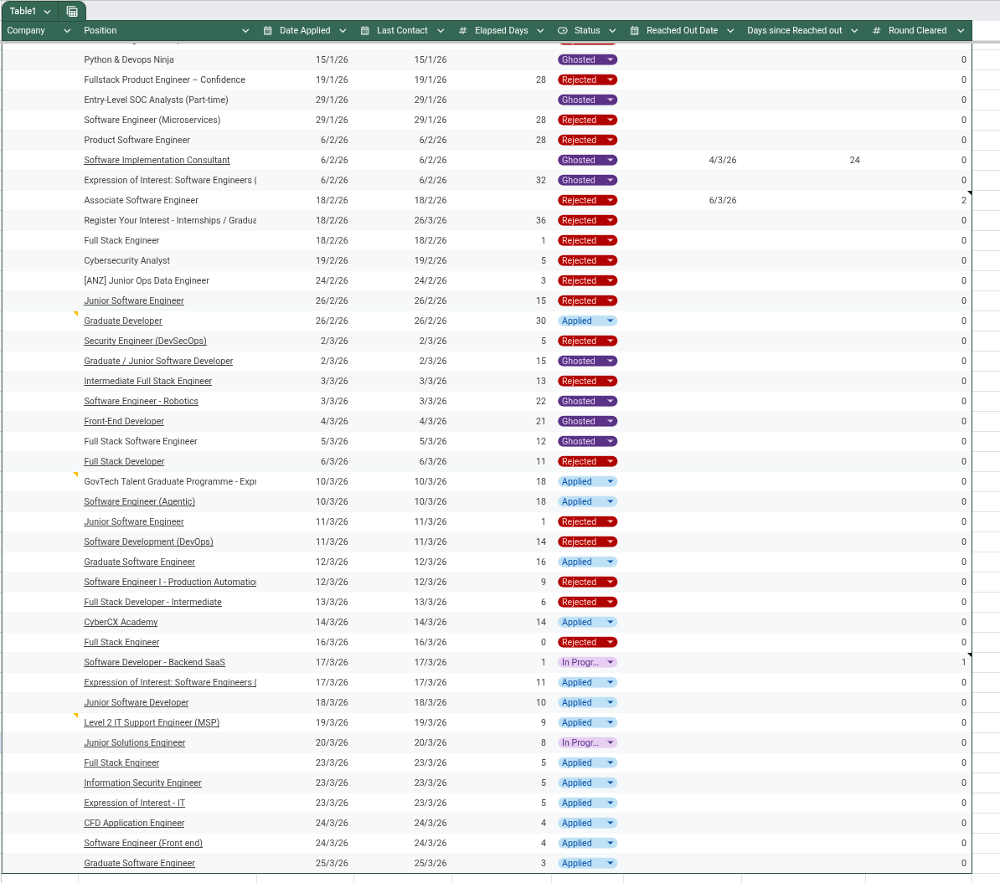

I don't need to tell you that applying for jobs has become tedious. There are lay offs happening every other week, and most job applications have about 200 other people also applying.

Then for every job application, you have to:
1. Research the company
2. Tailor your CV/resume
3. Write a cover letter for the company
4. Answer any additional question (one company I had to basically write an essay)

... and that's all just to actually apply at the job.

From there you wait about a month to either hear back you've moved onto the next step, either being an initial chat, written assessment, technical assessment or some other test entirely. Or if you're unlucky you'll get a rejection email. Or if you're even unluckier, the company will just ghost you.

I'm sick of all these job applications. So to distract myself I've whipped up a new tool.

> [!ABSTRACT] TLDR
> I've made a job application tracker called NextStep you can find it [here](https://github.com/ParthTri/NextStep).

# The Problem

I was tracking all my job applications that I had done and which stage I was in each application using a Google Sheet. Optimistic? Very. I fully believed the application world would be much more straight forward and reactive, but I was horribly disappointed.

Anyway here is an example of said spread sheet.

So simple fields to track, the company, the role, when I applied, when I heard from them last, how many days its been since, and the status of application.
Extra data like links and such would be easy to add.

Since I was already using tabled data, it's a fairly safe assumption to use a relational database, and since I was trying to make development and hosting on your own server as easy as possible, I opted to use SQLite.

# The Idea

I just wanted to build a project. Getting tired and burnt out from working on another one (sneak peak [avedii.com](https://avedii.com)). 

The core requirements for the MVP was pretty simple:
- Display all applications
- Add new applications
- Add custom categories

Then there was some other requirements, albeit self-imposed.
- Go through emails and automatically update application statuses
- Generate email responses to applications that haven't heard back from in a while
- Dashboard for displaying application statistics and response times

# Notable Takeaways

Inputting and manually tracking applications was quite easy. Get details, run a query; need to update, run a query. But there was a few 

## Reading, Filtering, and Categorising Emails

Reading and filtering through emails of the *user* only needed a few additions. For my purposes, using Gmail, all that was needed was using the `google-oauth-client` library to make interact with the Google APIs easier. There was a few hoops to jump through to get the application registered with in the Google developer console.

Filtering the emails was easy to do. Just use the role and the company as a compiled regex pattern, and run a `.search(message)` for each of the emails. If an email is found, now came the challenge of categorising it.

In the world of LLMs, I initially set out to use an open source AI model to categorise the email out of set of options. I needed a way of hosting the model and then be able to prompt the AI model, parse its results into the relevant category.

After toying around with different models and prompts, I came to a conclusion. LLMs are finicky. Despite hours of *prompt engineering*, I couldn't find a reliable way of categorising emails. In the end, I decided to just use keyword searching and weighted algorithm to identify which category it is most likely. 

To make this more useful, I hooked it up with `celery` as a scheduler so I can have this email pulling down every 30 minutes in the background. This led me to moving away from using SQLite as my database and Postgres, since there could have been multiple read and write issues, that throwing the database into it's own docker container would just be easier. Plus [Posgtres is awesome](https://github.com/dhamaniasad/awesome-postgres).

## Containerising Everything

The goal with this project was to let other people host it. I don't have any real desire to build this into a SaaS, for many reasons, but one of the main ones was, this is for people who are probably looking for a job and have applied to dozens of places and don't want to pay for something. Also this was just a toy project to see how it would look, and personally I think its pretty neat.

All that stuff aside, the goal was to make it easy to run and host. I want to be able to throw this onto a VM and do `git pull` and then just a `docker compose up` and its working. So everything was put into docker containers. 

The main services were:
- Web - The django app
- Postgres - Database 
- Redis - Queue management with celery
- Worker - the worker for all the celery tasks
- Beat - the background timer to make sure things go off in a regular fashion

All of this is put into a single docker network and have a `.env` to make managing environment variables like port and hosts easier. Simple.

# Fin and Future

At the current stage it does everything I want, so there's no real need to keep adding features. I'll probably added some extra niceties, like AI email responses for applications I haven't heard back from in a while, automatically moving applications to ghosted after *x* number of days. 

I'll also eventually finish out the Stats page, and add some charts when I feel like procrastinating or wasting a weekend.

Fin.